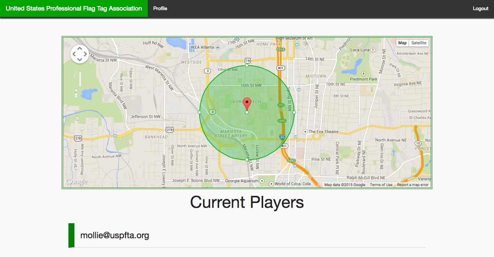
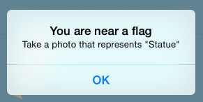

## Objective
Flagtag is a combination of tag and capture-the-flag, played in real space with digital flags. The first player to capture all the other players' flags wins the game. [or points]

## Players

* Up to 10 players
* Teams of 1 (free-for-all)

## Equipment

* The creator of the game needs a device capable of accessing the website. 
* Players need iOS devices that are GPS-enabled. 
* No physical flags are needed.

### Playing field

* The playing field is a circle with a radius and center determined by the game creator.

## Summary of play
[playing field]

## Before the game

### Creating a game

* The game creator accesses the website [link]. They then determine the center point and radius for the playing field, the start time, and the duration. The start time should be far enough in the future that players will have time to place their flags before the game begins.

* Invite players
	* User ID
	* Can invite self

### Once a game has been created

The game begins on the date and time set by the game creator.

* Players receive invites to the game. The invite shows the game master's username.
* The player can accept an invite from the invites screen
* Once a player has accepted an invite, they can then place their flag

#### Placing a flag
[Soltech directions state "Define the item you want them to take a selfie with by taking a selfie of yourself with that item"]

If a player does not place their flag before the game begins, that player is removed from the game.

## During the game

* Players can go to the location of their flag, and move it to a new point on the map [how does this work?]

### Moving your flag

### Tagging

When a player moves to within 100 meters (328 feet) of a flag, they will be allowed to tag the flag.

The player will then be provided with the flag's objective. The player should then take a photo and include some text based on the objective.

[distance]
[photo evidence]

Once a player has tagged a flag, the flag will be removed from their map.

### Score
The first person to find a particular flag gets the most points, while the last person to find that flag gets 1 point. The maximum points you can get for finding a flag is equal to the number of players in the game, minus one.

## After the game

[Potential feature addition]: Allow game creator to have extra scoring capabilities:
* Ability to throw out points for tags that did not meet the objective

### Winner

### Game summary

### Leaderboards

[what is a valid tag?]

possible features:
bonus points for best pic, granted by flag-placer
rule variant: teams. a simple version of this would be easy to implement. the game leader would invite team leaders, and then each team leader can determine their own team. teams would then operate as individuals normally do. a more complicated version could allow for one phone per player, and teams deciding who should find which flags.
rule variant for whether flag-placer needs to take a photo with their flag at the flag location or if they can drop a marker on a map to choose it
rule variant for whether or not flags can be moved
rule variant for whether winner is determined by fastest to find all flags or points
rule variant: after the game, the flag-placer sees all photos taken of their flag and allocates points to the best tags
privacy settings for game results
privacy settings for invites (possibly: open-invitation games)
game center 
have a way for the game organizer to invalidate tags (e.g. if someone posts a photo of the wrong item)
post-game stats:
	points
	fastest completion
	# of flags they were the first to find